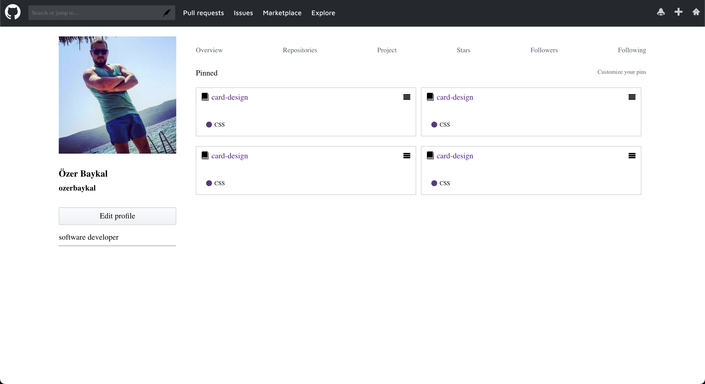

## Sass Project

This project is a web interface built with HTML, Sass, and a touch of SVG icons for an enhanced user experience.



### Project Structure

The project consists of a header, a main content section with profile information, and links. Key sections:

- Header: Includes navigation links and SVG icons for easy access to different sections.
- Main Content: Displays user profile information and project-related links.

### Technologies Used

- HTML: For the structure of the web page.
- Sass: For efficient and modular styling. The Sass file compiles into a single CSS file (main.css) for styling the page.
- SVG Icons: Used for scalable and high-quality icons in the navigation bar.

1. **Clone the Repository**:

   ```bash
   git clone https://github.com/ozerbaykal/sass_github_clone.git

   ```

2. **Run the App**: Open `index.html` in a browser.

### Usage

This project can serve as a base template for creating a personal portfolio or a user dashboard. You can modify the SVG icons, colors, and layout as desired.
